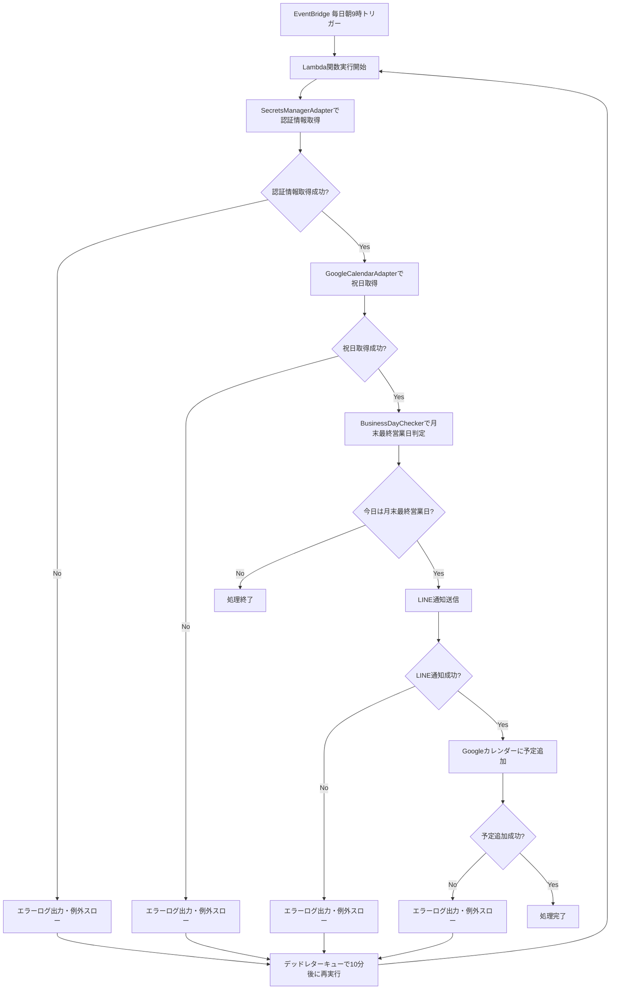

# 月末営業日チェックシステム 要件定義・設計書

## 1. プロジェクト概要

### 基本情報

- **プロジェクト名**: 月末営業日チェックシステム
- **要望ID**: REQ-001
- **タイトル**: 月末の最終営業日当日に私自身に通知を送る
- **作成日**: 2025年6月26日

### 目的・背景・ゴール

- **目的**: 月末の最終営業日当日に私自身に通知を送る
- **背景**: 所属企業において、月末の最終営業日にだけ実施する作業がある。ただ、月に1回の作業であるため、対応忘れが頻発してしまう
- **ゴール**: 毎月末の最終営業日に発生する作業の対応漏れをなくす
- **スコープ**: 毎日1回定期的にトリガーされ、トリガー時の日付が月末の最終営業日かどうか判断するワークフローを作成する。UI画面は不要。
- **制約条件**: 特になし
- **判断基準（優先順位）**: 1. 法令対応, 2. 重大バグ修正, 3. KGI/KPIインパクト大, 4. 顧客要望（複数社）, 5. 工数小

## 2. 要件定義

### 2.1 機能要件

#### 基本機能

1. **月末最終営業日判定**
   - 毎日朝9時に自動実行
   - 土日祝日を除外した営業日判定
   - 月末の最終営業日かどうかの判定

2. **通知機能**
   - 月末最終営業日に該当する場合、LINE通知を送信
   - 通知メッセージ：「‼️今日は本人確認をする日‼️」

3. **Googleカレンダー予定追加機能**（追加要件）
   - 月末最終営業日に該当する場合、Googleカレンダーに予定を追加
   - 予定タイトル：「月末の最終営業日」
   - 時間：17:00-17:15（JST）
   - リマインド：3時間前、2時間前、1時間前

#### エラーハンドリング

- エラー発生時の再試行処理（デッドレターキュー機能利用）
- 再実行間隔：10分
- 最大再実行回数：3回
- ログ出力レベル：info/error/warn

### 2.2 非機能要件

- **可用性**: 毎日朝9時の定期実行を確実に実施
- **信頼性**: エラー時の適切な再試行処理
- **セキュリティ**: AWS Secrets Managerによる認証情報管理
- **保守性**: 適切なログ出力とエラーハンドリング

## 3. 技術仕様

### 3.1 技術スタック

- **言語**: TypeScript
- **インフラ**: AWS CDK
- **実行環境**: AWS Lambda (Node.js 22.x)
- **スケジューラー**: AWS EventBridge
- **認証情報管理**: AWS Secrets Manager
- **再試行処理**: SQS デッドレターキュー
- **外部API**:
  - LINE Messaging API
  - Google Calendar API

### 3.2 システム構成

```mermaid
EventBridge (毎日朝9時) 
    ↓
Lambda関数 (月末営業日チェック)
    ↓
SecretsManager → 認証情報取得
    ↓
GoogleCalendar API → 祝日取得
    ↓
BusinessDayChecker → 営業日判定
    ↓
LINE API → 通知送信
    ↓
GoogleCalendar API → 予定追加
```

### 3.3 処理フロー



## 4. 設計方針

### 4.1 アーキテクチャ設計

- **レイヤー分離**: インフラ層、アプリケーション層、ドメイン層の分離
- **責務分離**: 各クラス・モジュールの単一責任原則
- **依存性注入**: 外部サービスとの疎結合

### 4.2 データ設計

- **認証情報管理**: AWS Secrets Manager
  - channelId, channelSecret, lineKid, linePrivateKey
  - calendarId, calendarPrivateKey, calendarClientEmail
- **環境変数**: SECRETS_NAME（Secrets Manager名）

### 4.3 エラーハンドリング設計

- **再試行方式**: Lambda関数のデッドレターキュー機能
- **ログ出力**: 構造化ログ（JSON形式）
- **エラー分類**: 認証エラー、API通信エラー、処理エラー

## 5. 実装計画

### 5.1 変更対象ファイル

- `src/secretsManager.ts` / 新規作成 / SecretsManagerAdapterクラス
- `src/monthlyEndBusinessDayCheck.ts` / 修正 / 認証情報取得処理統合、予定追加処理、エラーハンドリング強化
- `src/googleCalendar.ts` / 修正 / addEventメソッド（リマインド設定追加）
- `lib/monthly_end-business_day_check-stack.ts` / 修正 / デッドレターキュー設定追加

### 5.2 開発工数見積

| タスク | 工数 | 備考 |
|--------|------|------|
| SecretsManagerAdapterクラス作成 | 0.5日 | AWS SDK使用、型定義含む |
| monthlyEndBusinessDayCheck.ts修正 | 0.5日 | 認証情報取得処理統合、エラーハンドリング強化 |
| 予定追加処理統合（リマインド設定含む） | 0.5日 | 既存addEventメソッド活用、リマインド設定追加 |
| CDKスタック修正（デッドレターキュー設定） | 0.25日 | SQS、EventBridge設定追加 |
| テスト作成・実行 | 0.5日 | 単体テスト、統合テスト |
| デプロイ・動作確認 | 0.25日 | AWS CDKデプロイ、動作検証 |
| **合計** | **2.5人日** | |

### 5.3 段階的リリース方針

#### Phase 1: 基盤強化

- SecretsManagerAdapterクラス作成
- エラーハンドリング強化
- 既存機能の動作確認

#### Phase 2: 機能追加

- Googleカレンダー予定追加機能実装
- 統合テスト実施

#### Phase 3: 本番リリース

- 本番環境へのデプロイ
- 動作監視・ログ確認

## 6. 技術仕様詳細

### 6.1 Googleカレンダー予定仕様

- **タイトル**: 「月末の最終営業日」
- **開始時刻**: 17:00 (JST)
- **終了時刻**: 17:15 (JST)
- **リマインド**: 3時間前、2時間前、1時間前
- **タイムゾーン**: Asia/Tokyo

### 6.2 認証情報管理

- **管理方式**: AWS Secrets Manager
- **取得項目**:
  - LINE API: channelId, channelSecret, lineKid, linePrivateKey
  - Google Calendar API: calendarId, calendarPrivateKey, calendarClientEmail

### 6.3 ログ出力仕様

- **ログレベル**: info/error/warn
- **出力形式**: JSON形式
- **出力項目**: タイムスタンプ、ログレベル、メッセージ、エラー詳細

## 7. テスト計画

### 7.1 単体テスト

- BusinessDayCheckerクラス
- SecretsManagerAdapterクラス
- GoogleCalendarAdapterクラス
- LineNotifyAdapterクラス

### 7.2 統合テスト

- 月末最終営業日判定フロー
- 通知送信フロー
- 予定追加フロー
- エラーハンドリングフロー

### 7.3 動作確認

- 本番環境での定期実行確認
- エラー時の再試行確認
- ログ出力確認

## 8. 運用・保守

### 8.1 監視項目

- Lambda関数の実行状況
- エラー発生率
- 再試行回数
- 外部API応答時間

### 8.2 ログ分析

- CloudWatch Logsでのログ確認
- エラーパターンの分析
- パフォーマンス監視

### 8.3 障害対応

- エラー発生時の原因調査
- 再試行処理の確認
- 外部API障害時の対応

## 9. リスク・課題

### 9.1 技術的リスク

- 外部API（LINE、Google Calendar）の障害
- AWS Secrets Managerの認証情報漏洩
- Lambda関数のタイムアウト

### 9.2 対策

- 適切なエラーハンドリングと再試行処理
- 認証情報の定期的な更新
- タイムアウト設定の最適化

## 10. 今後の拡張性

### 10.1 拡張可能な機能

- 複数ユーザー対応
- 通知チャンネルの追加（Slack、メール等）
- カレンダー予定の詳細設定
- ダッシュボード機能

### 10.2 技術的拡張性

- マイクロサービス化
- コンテナ化
- マルチリージョン対応

---

**文書作成日**: 2025年6月26日
**作成者**: AI Assistant
**承認者**: ko-uema2
**バージョン**: 1.0
