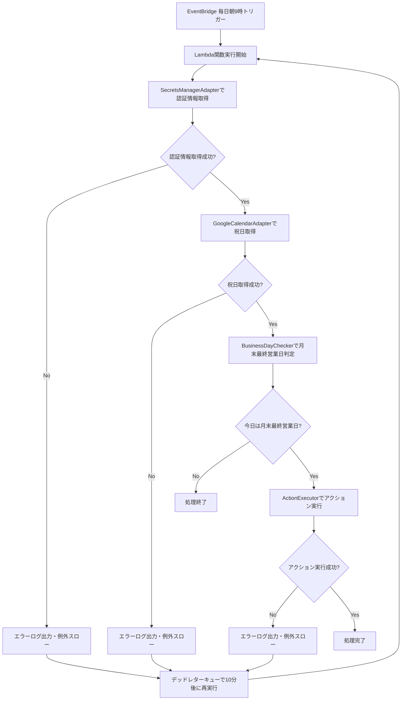

# 月末営業日チェックシステム 要件定義・設計書

## 1. プロジェクト概要

### 基本情報

- **プロジェクト名**: 月末営業日チェックシステム
- **要望ID**: REQ-001
- **タイトル**: 月末の最終営業日当日に私自身に通知を送る
- **作成日**: 2025年6月

### 目的・背景・ゴール

- **目的**: 月末の最終営業日当日に私自身に通知を送る
- **背景**: 所属企業において、月末の最終営業日にだけ実施する作業がある。ただ、月に1回の作業であるため、対応忘れが頻発してしまう
- **ゴール**: 毎月末の最終営業日に発生する作業の対応漏れをなくす
- **スコープ**: 毎日1回定期的にトリガーされ、トリガー時の日付が月末の最終営業日かどうか判断するワークフローを作成する。UI画面は不要。
- **制約条件**: 特になし
- **判断基準（優先順位）**: 1. 法令対応, 2. 重大バグ修正, 3. KGI/KPIインパクト大, 4. 顧客要望（複数社）, 5. 工数小

## 2. 要件定義

### 2.1 機能要件

#### 基本機能

1. **月末最終営業日判定**
   - 毎日朝9時に自動実行
   - 土日祝日を除外した営業日判定
   - 月末の最終営業日かどうかの判定

2. **通知機能**
   - 月末最終営業日に該当する場合、LINE通知を送信
   - 通知メッセージ：「‼️今日は本人確認をする日‼️」

3. **Googleカレンダー予定追加機能**（追加要件）
   - 月末最終営業日に該当する場合、Googleカレンダーに予定を追加
   - 予定タイトル：「月末の最終営業日」
   - 時間：17:00-17:15（JST）
   - リマインド：3時間前、2時間前、1時間前

#### エラーハンドリング

- エラー発生時の再試行処理（デッドレターキュー機能利用）
- 再実行間隔：10分
- 最大再実行回数：3回
- ログ出力レベル：info/error/warn

### 2.2 非機能要件

- **可用性**: 毎日朝9時の定期実行を確実に実施
- **信頼性**: エラー時の適切な再試行処理
- **セキュリティ**: AWS Secrets Managerによる認証情報管理
- **保守性**: 適切なログ出力とエラーハンドリング
- **拡張性**: 責務分離による保守性と拡張性の向上

## 3. 技術仕様

### 3.1 技術スタック

- **言語**: TypeScript
- **インフラ**: AWS CDK
- **実行環境**: AWS Lambda (Node.js 22.x)
- **スケジューラー**: AWS EventBridge
- **認証情報管理**: AWS Secrets Manager
- **再試行処理**: SQS デッドレターキュー
- **外部API**:
  - LINE Messaging API
  - Google Calendar API

### 3.2 システム構成

```mermaid
EventBridge (毎日朝9時) 
    ↓
Lambda関数 (月末営業日チェック)
    ↓
SecretsManager → 認証情報取得
    ↓
GoogleCalendar API → 祝日取得
    ↓
BusinessDayChecker → 営業日判定
    ↓
ActionExecutor → アクション実行
    ↓
LINE API + GoogleCalendar API → 通知・予定追加
```

### 3.3 処理フロー



## 4. 設計方針

### 4.1 アーキテクチャ設計

- **レイヤー分離**: インフラ層、アプリケーション層、ドメイン層の分離
- **責務分離**: 各クラス・モジュールの単一責任原則
- **依存性注入**: 外部サービスとの疎結合
- **アクション実行の責務分離**: ActionExecutorクラスによるアクション実行の集約
- **カプセル化**: ActionExecutorがアダプターのインスタンス化と管理を担当

### 4.2 データ設計

- **認証情報管理**: AWS Secrets Manager
  - channelId, channelSecret, lineKid, linePrivateKey
  - calendarId, calendarPrivateKey, calendarClientEmail
- **環境変数**: SECRETS_NAME（Secrets Manager名）

### 4.3 エラーハンドリング設計

- **再試行方式**: Lambda関数のデッドレターキュー機能
- **ログ出力**: 構造化ログ（JSON形式）
- **エラー分類**: 認証エラー、API通信エラー、処理エラー

## 5. 実装計画

### 5.1 変更対象ファイル

- `src/secretsManager.ts` / 新規作成 / SecretsManagerAdapterクラス
- `src/actionExecutor.ts` / 新規作成 / ActionExecutorクラス（責務分離）
- `src/monthlyEndBusinessDayCheck.ts` / 修正 / 認証情報取得処理統合、ActionExecutor統合、エラーハンドリング強化
- `src/googleCalendar.ts` / 修正 / addEventメソッド（リマインド設定追加）
- `lib/monthly_end-business_day_check-stack.ts` / 修正 / デッドレターキュー設定追加

### 5.2 開発工数見積

| タスク | 工数 | 備考 |
|--------|------|------|
| SecretsManagerAdapterクラス作成 | 0.5日 | AWS SDK使用、型定義含む |
| ActionExecutorクラス作成 | 0.25日 | 責務分離によるアクション実行集約 |
| monthlyEndBusinessDayCheck.ts修正 | 0.5日 | 認証情報取得処理統合、ActionExecutor統合、エラーハンドリング強化 |
| 予定追加処理統合（リマインド設定含む） | 0.5日 | 既存addEventメソッド活用、リマインド設定追加 |
| CDKスタック修正（デッドレターキュー設定） | 0.25日 | SQS、EventBridge設定追加 |
| テスト作成・実行 | 0.5日 | 単体テスト、統合テスト |
| デプロイ・動作確認 | 0.25日 | AWS CDKデプロイ、動作検証 |
| **合計** | **2.75人日** | |

### 5.3 段階的リリース方針

#### Phase 1: 基盤強化

- SecretsManagerAdapterクラス作成
- ActionExecutorクラス作成（責務分離）
- エラーハンドリング強化
- 既存機能の動作確認

#### Phase 2: 機能追加

- Googleカレンダー予定追加機能実装
- 統合テスト実施

#### Phase 3: 本番リリース

- 本番環境へのデプロイ
- 動作監視・ログ確認

## 6. 技術仕様詳細

### 6.1 Googleカレンダー予定仕様

- **タイトル**: 「月末の最終営業日」
- **開始時刻**: 17:00 (JST)
- **終了時刻**: 17:15 (JST)
- **リマインド**: 3時間前、2時間前、1時間前
- **タイムゾーン**: Asia/Tokyo

### 6.2 認証情報管理

- **管理方式**: AWS Secrets Manager
- **取得項目**:
  - LINE API: channelId, channelSecret, lineKid, linePrivateKey
  - Google Calendar API: calendarId, calendarPrivateKey, calendarClientEmail

### 6.3 LINE API仕様

- **使用SDK**: @line/bot-sdk
- **使用クラス**:
  - MessagingApiClient（messagingApi.MessagingApiClient）
  - ChannelAccessTokenClient（channelAccessToken.ChannelAccessTokenClient）
- **認証方式**: JWT認証（node-joseライブラリ使用）
- **送信方式**: プッシュメッセージ（指定ユーザーIDへの直接送信）
- **メッセージ形式**: テキストメッセージ
- **認証情報形式**:
  - linePrivateKey: JSONオブジェクト形式（JWK形式）
  - 文字列形式は非対応（Secrets Managerから取得時はオブジェクト形式）
- **JWTトークン生成**:
  - ライブラリ: node-jose
  - アルゴリズム: RS256
  - ヘッダー: alg, typ, kid
  - ペイロード: iss, sub, aud, exp, token_exp
  - プライベートキー処理: オブジェクト形式を直接使用（JSON.parse()不要）
- **チャンネルアクセストークン取得**:
  - メソッド: ChannelAccessTokenClient.issueChannelTokenByJWT
  - 引数: grant_type, client_assertion_type, client_assertion
  - 戻り値: access_token
- **API呼び出し形式**:

  ```typescript
  await client.pushMessage({
    to: userId,
    messages: [{ type: "text", text: message }]
  });
  ```

### 6.4 ログ出力仕様

- **ログレベル**: info/error/warn
- **出力形式**: JSON形式
- **出力項目**: タイムスタンプ、ログレベル、メッセージ、エラー詳細

### 6.5 クラス設計

- **ActionExecutor**: 月末最終営業日のアクション実行を担当
  - 責務：LINE通知とGoogleカレンダー予定追加の実行、アダプタークラスのインスタンス化
  - `executeMonthlyEndActions()`: LINE通知とカレンダー予定追加を一括実行
  - `sendLineNotification()`: LINE通知送信（プライベート）
  - `addCalendarEvent()`: Googleカレンダー予定追加（プライベート）
  - コンストラクタ：認証情報を受け取り、LineNotifyAdapterとGoogleCalendarAdapterをインスタンス化

- **LineNotifyAdapterクラス**: LINE通知送信を担当
  - 責務：LINE Messaging APIを使用したプッシュメッセージ送信
  - 使用API：@line/bot-sdk の MessagingApiClient、ChannelAccessTokenClient
  - 認証方式：JWT認証（node-joseライブラリ使用）
  - `sendMessage()`: テキストメッセージの送信
  - `generateChannelAccessToken()`: JWTトークンを使用したチャンネルアクセストークン生成
  - 認証：channelId、lineKid、linePrivateKeyを使用したJWT認証
  - linePrivateKey処理：オブジェクト形式を直接使用（JSON.parse()処理なし）
  - チャンネルアクセストークン取得：ChannelAccessTokenClient.issueChannelTokenByJWTメソッド使用
  - 送信形式：プッシュメッセージ（指定ユーザーIDへの直接送信）

- **GoogleCalendarHolidayFetcherクラス**: Google Calendarからの祝日情報取得を担当
  - 責務：Google Calendar APIを使用した祝日情報の読み取り
  - `fetchHolidays()`: 指定日付の祝日情報を取得
  - 認証：Google Calendar API認証情報（clientEmail、privateKey）

- **GoogleCalendarEventCreatorクラス**: Google Calendarへのイベント追加を担当
  - 責務：Google Calendar APIを使用したイベントの書き込み
  - `addEvent()`: イベントの追加（リマインド設定含む）
  - 認証：Google Calendar API認証情報（clientEmail、privateKey）
  - リマインド設定：3時間前、2時間前、1時間前

- **GoogleCalendarBaseクラス**: Google Calendar APIの共通認証処理を提供
  - 責務：Google Calendar APIの認証設定
  - 基底クラス：GoogleCalendarHolidayFetcherとGoogleCalendarEventCreatorの共通処理

### 6.6 Lambda関数仕様

- **トリガー**: EventBridge Scheduled Event
- **実行頻度**: 毎日朝9時（JST）
- **イベント処理**: EventBridgeのScheduledEventオブジェクトから実行日時を取得
- **営業日判定**: EventBridgeの実行日時を基に月末最終営業日を判定
- **タイムアウト**: 30秒
- **メモリ**: 256MB

### 6.7 EventBridge仕様

- **イベントタイプ**: Scheduled Event
- **スケジュール式**: `cron(0 0 9 * * ? *)` (毎日朝9時JST)
- **イベント構造**: AWS標準のScheduledEvent形式
- **実行日時**: イベントオブジェクトの`time`フィールド（ISO 8601形式）

## 7. テスト計画

### 7.1 単体テスト

- BusinessDayCheckerクラス
- SecretsManagerAdapterクラス
- ActionExecutorクラス
- GoogleCalendarHolidayFetcherクラス
- GoogleCalendarEventCreatorクラス
- LineNotifyAdapterクラス

### 7.2 統合テスト

- 月末最終営業日判定フロー
- アクション実行フロー
- エラーハンドリングフロー

### 7.3 動作確認

- 本番環境での定期実行確認
- エラー時の再試行確認
- ログ出力確認

## 8. 運用・保守

### 8.1 監視項目

- Lambda関数の実行状況
- エラー発生率
- 再試行回数
- 外部API応答時間

### 8.2 ログ分析

- CloudWatch Logsでのログ確認
- エラーパターンの分析
- パフォーマンス監視

### 8.3 障害対応

- エラー発生時の原因調査
- 再試行処理の確認
- 外部API障害時の対応

## 9. リスク・課題

### 9.1 技術的リスク

- 外部API（LINE、Google Calendar）の障害
- AWS Secrets Managerの認証情報漏洩
- Lambda関数のタイムアウト
- 認証情報形式の不整合（linePrivateKeyの形式エラー）

### 9.2 対策

- 適切なエラーハンドリングと再試行処理
- 認証情報の定期的な更新
- タイムアウト設定の最適化
- 認証情報形式の統一（linePrivateKeyはオブジェクト形式で管理）

## 10. 今後の拡張性

### 10.1 拡張可能な機能

- 複数ユーザー対応
- 通知チャンネルの追加（Slack、メール等）
- カレンダー予定の詳細設定
- ダッシュボード機能
- 新しいアクションの追加（ActionExecutorの拡張）

### 10.2 技術的拡張性

- マイクロサービス化
- コンテナ化
- マルチリージョン対応

## 11. アーキテクチャ決定レコード

プロジェクトの重要な技術的決定は、[アーキテクチャ決定レコード（ADR）](./adr/)で管理されています。

### 関連ADR

- [ADR-001: LineNotifyAdapterでのMessagingApiClientの遅延インスタンス化](./adr/001-line-notify-adapter-messaging-client-instantiation.md)
- [ADR-002: Google Calendarクラスの責務分離](./adr/002-google-calendar-class-separation.md)

---

**文書作成日**: 2025年6月
**作成者**: AI Assistant
**承認者**: [要記入]
**バージョン**: 1.6

## 変更履歴

| バージョン | 日付 | 変更内容 | 変更者 |
|------------|------|----------|--------|
| 1.0 | 2025年6月 | 初版作成 | AI Assistant |
| 1.1 | 2025年6月 | ActionExecutor責務分離、エラーハンドリング強化 | AI Assistant |
| 1.2 | 2025年6月 | LINE API仕様更新（MessagingApiClient使用） | AI Assistant |
| 1.3 | 2025年6月 | JWT認証実装（node-joseライブラリ使用） | AI Assistant |
| 1.4 | 2025年6月 | ChannelAccessTokenClient実装（issueChannelTokenByJWT使用） | AI Assistant |
| 1.5 | 2025年6月 | Google Calendarクラス分割（HolidayFetcher/EventCreator責務分離） | AI Assistant |
| 1.6 | 2025年6月 | LINE Notify API認証処理修正（linePrivateKeyオブジェクト形式対応） | AI Assistant |
